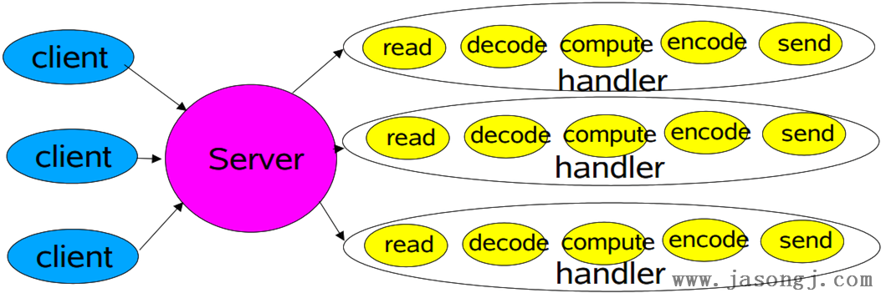
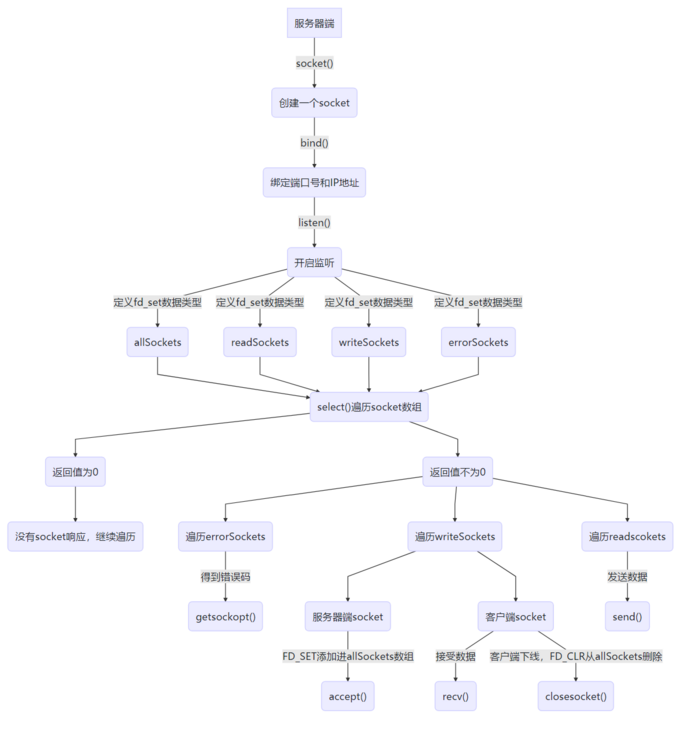
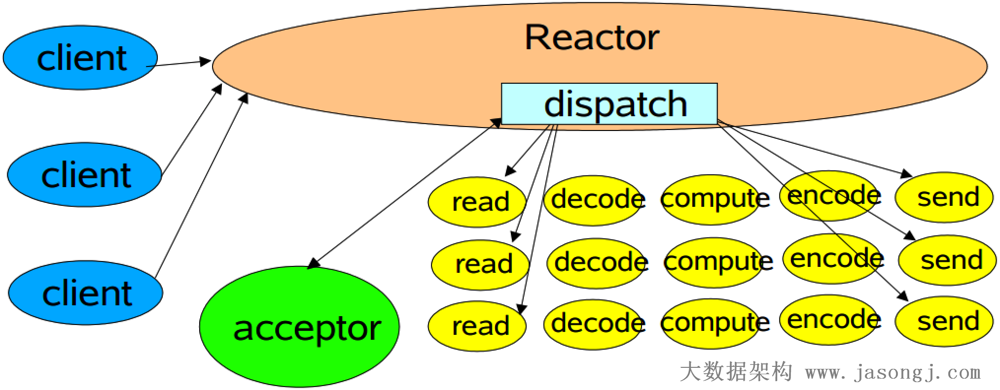
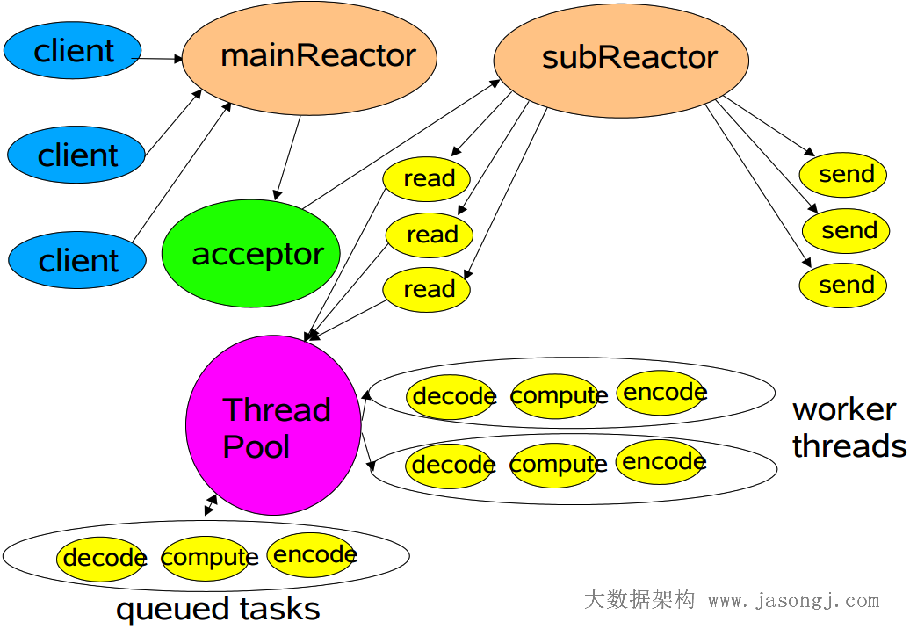

# netty

---

## 代码来源

https://netty.io/wiki/user-guide-for-4.x.html

## nio reactor演变

文章来源:[nio_reactor](http://www.jasongj.com/java/nio_reactor/)

### BIO下的服务器实现

#### 单线程逐个处理所有请求

使用单线程逐个处理所有请求，同一时间只能处理一个请求，等待I/O的过程浪费大量CPU资源，同时无法充分使用多CPU的优势

#### 为每个请求创建一个线程

使用多线程对阻塞I/O模型的改进。一个连接建立成功后，创建一个单独的线程处理其I/O操作

为防止连接请求过多，导致服务器创建的线程数过多，造成过多线程上下文切换的开销,需要使用线程池实现

#### Reactor模式

##### 原理基于select

select()函数主要解决的是accept()函数阻塞问题，而没有解决recv()和send()函数阻塞问题

- **Reactor** 将I/O事件发派给对应的Handler
- **Acceptor** 处理客户端连接请求
- **Handlers** 执行非阻塞读/写

##### 经典Reactor模式

多个Channel可以注册到同一个Selector对象上，实现了一个线程同时监控多个请求状态（Channel）

尽管一个线程可同时监控多个请求（Channel），但是所有读/写请求以及对新连接请求的处理都在同一个线程中处理，无法充分利用多CPU的优势，同时读/写操作也会阻塞对新连接请求的处理。

##### 多工作线程Reactor模式

引入多线程，并行处理多个读/写操作

##### 多Reactor

Netty中使用的Reactor模式，引入了多Reactor，也即一个主Reactor负责监控所有的连接请求，多个子Reactor负责监控并处理读/写请求，减轻了主Reactor的压力，降低了主Reactor压力太大而造成的延迟。

并且每个子Reactor分别属于一个独立的线程，每个成功连接后的Channel的所有操作由同一个线程处理。这样保证了同一请求的所有状态和上下文在同一个线程中，避免了不必要的上下文切换，同时也方便了监控请求响应状态。

